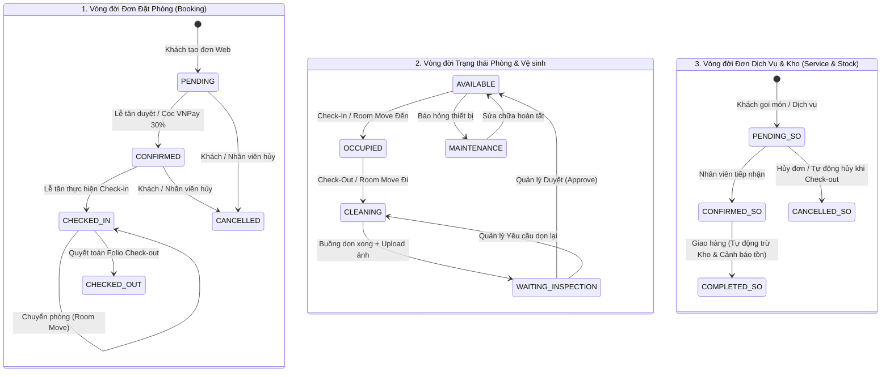

# DeepBlue Haven Resort - Hệ thống Quản lý Khách sạn & Khu nghỉ dưỡng (PMS)

Hệ thống Quản lý Khách sạn và Khu nghỉ dưỡng (Property Management System - PMS) toàn diện cho DeepBlue Haven Resort. Dự án được xây dựng bằng Java Spring Boot 3 và kiến trúc MVC Thymeleaf, số hóa toàn bộ quy trình vận hành: từ cổng đặt phòng trực tuyến của khách hàng, sơ đồ phòng tiền sảnh (Room Rack), điều phối buồng phòng với ảnh minh chứng chất lượng, phục vụ F&B/Minibar tự động trừ kho, quyết toán hóa đơn Folio thông minh đến hệ thống CRM tích điểm tự động nâng hạng thẻ thành viên.

## Demo trực tuyến

Hệ thống khởi chạy tại môi trường nội bộ / local:

- **Cổng thông tin & Khách hàng**: `http://localhost:8080/deepbluehaven`
- **Cổng Quản trị & Vận hành**: `http://localhost:8080/deepbluehaven/staff-login` 

## Mục lục

- [Tính năng chính](#tính-năng-chính)
- [Công nghệ sử dụng](#công-nghệ-sử-dụng)
- [Yêu cầu hệ thống](#yêu-cầu-hệ-thống)
- [Cài đặt nhanh](#cài-đặt-nhanh)
- [Cấu hình hệ thống (Properties)](#cấu-hình-hệ-thống-properties)
- [Cơ sở dữ liệu và Seed Data](#cơ-sở-dữ-liệu-và-seed-data)
- [Luồng nghiệp vụ và State Machine](#luồng-nghiệp-vụ-và-state-machine)
- [Các lệnh thường dùng](#các-lệnh-thường-dùng)
- [Cấu trúc thư mục](#cấu-trúc-thư-mục)
- [Tài khoản demo](#tài-khoản-demo)
- [Triển khai production](#triển-khai-production)
- [Ghi chú bảo trì](#ghi-chú-bảo-trì)

## Tính năng chính

### Website khách hàng (Customer Portal)

- Trang chủ giới thiệu khu nghỉ dưỡng, danh sách hạng phòng nghỉ cao cấp, tiện ích nghỉ dưỡng, thư viện ảnh và thông tin liên hệ.
- Tìm kiếm phòng theo loại phòng, ngày nhận/trả phòng và số lượng khách với bộ lọc trực quan.
- Trang chi tiết phòng nghỉ hiển thị tiện nghi, sức chứa, bảng giá theo mùa vụ và chính sách đặt phòng.
- Đặt phòng trực tuyến với cơ chế chống trùng lịch (*Pessimistic Locking*).
- Tích hợp cổng thanh toán trực tuyến VNPay Sandbox (đặt cọc trước 30% giá trị đặt phòng).
- Gọi món F&B và dịch vụ phòng (In-room Services: Spa, giặt ủi, ẩm thực, xe đưa đón).
- Quản lý lịch sử đặt phòng, xem chi tiết hóa đơn Folio, tra cứu mã đơn `DBH-YYYY-XXX` và hủy đặt phòng hợp lệ.
- Hệ thống CRM Khách hàng thân thiết: tự động tích lũy điểm thưởng theo tỷ lệ chi tiêu, tự động thăng hạng thẻ thành viên (`Bronze` $\rightarrow$ `Silver` $\rightarrow$ `Gold` $\rightarrow$ `Platinum` $\rightarrow$ `Diamond`), ví voucher cá nhân (`CustomerDiscount`).
- Khung chatbox hỗ trợ khách hàng trực tuyến 24/7.

### Tiền sảnh & Lễ tân (Receptionist PMS)

- Sơ đồ phòng trực quan (Room Rack Grid): hiển thị toàn bộ phòng theo mã màu trạng thái thời gian thực (`Available`, `Occupied`, `Cleaning`, `Maintenance`).
- Tiếp nhận nhận phòng (Check-in) cho khách đặt trước hoặc tạo đơn đặt phòng trực tiếp tại quầy (Walk-in Booking).
- Nghiệp vụ chuyển phòng (Room Move): đổi phòng linh hoạt cho khách đang lưu trú; tự động chuyển phòng cũ sang `Cleaning` và sinh task dọn buồng ngay lập tức.
- Tạo và điều phối đơn dịch vụ tại quầy cho khách lưu trú hoặc khách vãng lai.
- Quy trình trả phòng (Check-out) & Quyết toán Folio:
  - Tự động tính phụ phí nhận sớm / trả muộn (Early Check-in / Late Check-out 30% - 50%).
  - Áp dụng Voucher khuyến mãi và chiết khấu theo hạng thẻ thành viên.
  - Tự động khấu trừ số tiền cọc VNPay đã thanh toán trước.
  - Tự động hủy các đơn dịch vụ chưa phục vụ (`Pending Service Orders`).
  - Chuyển phòng sang trạng thái `Cleaning` và tạo task vệ sinh buồng phòng.
  - In hóa đơn Folio chuẩn format khách sạn (`/receptionist/invoice/{id}/print`).

### Nghiệp vụ Buồng phòng (Housekeeper)

- Danh sách công việc cá nhân được phân bổ theo ca trực và theo tầng.
- Quy trình dọn phòng & minh chứng chất lượng: Chuyển trạng thái `Cleaning` $\rightarrow$ Tải ảnh chụp hiện trường sau khi dọn lên Cloudinary CDN $\rightarrow$ Chuyển sang `Waiting Inspection`.
- Ghi nhận tiêu thụ Minibar tại phòng: tự động tạo đơn dịch vụ đã hoàn thành và trừ số lượng tồn kho tương ứng.
- Báo cáo sự cố phòng (Maintenance Issue): chuyển phòng sang trạng thái `Maintenance` và tạo yêu cầu sửa chữa kỹ thuật.
- Lịch sử công việc và hỗ trợ xuất file báo cáo CSV.

### Quản trị & Điều hành (Manager)

- Bảng điều khiển KPI: Tổng quan doanh thu, tỷ lệ lấp đầy phòng (Occupancy Rate), trạng thái phòng và cảnh báo vận hành.
- Trung tâm nghiệm thu buồng phòng (Housekeeping Queue): Xem ảnh minh chứng, duyệt hoàn thành (`Approve` $\rightarrow$ Phòng thành `Available`) hoặc yêu cầu dọn lại (`Reject`).
- Quản lý danh mục dịch vụ & Đơn hàng khách: Thêm/sửa món ăn, dịch vụ; tự động xuất kho khi hoàn tất giao hàng.
- Quản lý kho bãi & Chuỗi cung ứng (Inventory Control): Theo dõi tồn kho vật tư, nhập/xuất kho, tự động gửi cảnh báo khi hàng hóa dưới định mức tồn kho tối thiểu (Low Stock Alert).
- Xuất dữ liệu báo cáo dạng CSV (chuẩn mã hóa UTF-8 BOM):
  - Xuất dữ liệu tồn kho hàng hóa (Inventory CSV).
  - Xuất sổ nhật ký doanh thu & thanh toán (Revenue Ledger CSV).
  - Xuất số liệu công suất phòng (Occupancy Metrics CSV).
- Quản lý nhân sự và theo dõi điểm hiệu suất (Performance Score).

### Quản trị hệ thống (Admin)

- Quản lý danh sách tài khoản nhân viên, cấp phát vai trò (`Customer`, `Receptionist`, `Housekeeper`, `Manager`, `Admin`).
- Hệ thống Nhật ký Kiểm toán tập trung (Centralized Audit Logs): Lưu vết toàn bộ biến động dữ liệu đặt phòng, trạng thái phòng, thanh toán hóa đơn và xuất nhập kho.
- Hệ thống thông báo thời gian thực với bộ đếm badge tự động cập nhật qua cơ chế Polling nền (`notification-poller.js`).

## Công nghệ sử dụng

- Java 21 LTS
- Spring Boot 3.x (Spring Web MVC, Spring Data JPA)
- Thymeleaf 3.1 Template Engine
- MySQL 8.0 với Transaction Management (`@Transactional`)
- Redis (Quản lý phiên đăng nhập và Cache hiệu năng cao)
- VNPay Payment Gateway SDK (Mã hóa bảo mật HMAC-SHA512)
- Cloudinary Java SDK (Lưu trữ và tối ưu hóa hình ảnh CDN)
- Twilio & JavaMailSender (Email thông báo và xác thực OTP)
- Vanilla CSS3 Module hóa (Hệ thống Design Tokens, Glassmorphism, Responsive)
- Vanilla JavaScript ES6+ (Tách biệt 100% JS khỏi HTML, pagination, toast notification, badge poller)
- Font Awesome 6 Pro & Google Fonts (Plus Jakarta Sans, Inter, Playfair Display)

## Yêu cầu hệ thống

- Java Development Kit (JDK) 21 hoặc mới hơn
- Apache Maven 3.8+ (hoặc dùng `mvnw` tích hợp sẵn trong repo)
- MySQL Server 8.0 trở lên
- Redis Server (tùy chọn / khuyến nghị cho môi trường production)

## Cài đặt nhanh

```bash
# 1. Clone repository
git clone https://github.com/your-username/Deepblue-Haven-Resort.git
cd Deepblue-Haven-Resort/deepbluehaven

# 2. Tạo cơ sở dữ liệu MySQL
# CREATE DATABASE deepbluehaven CHARACTER SET utf8mb4 COLLATE utf8mb4_unicode_ci;

# 3. Cấu hình file src/main/resources/application.properties phù hợp với môi trường của bạn

# 4. Biên dịch và khởi chạy dự án
mvn clean compile -DskipTests
mvn spring-boot:run
```

Sau khi ứng dụng khởi chạy thành công, truy cập:

```text
http://localhost:8080
```

Trang đăng nhập:

```text
http://localhost:8080/auth/login
```

## Cấu hình hệ thống (Properties)

Cập nhật thông tin trong file `src/main/resources/application.properties`:

```properties
# Server
server.port=8080
server.servlet.context-path=/

# Database (MySQL)
spring.datasource.url=jdbc:mysql://localhost:3306/deepbluehaven?useSSL=false&serverTimezone=Asia/Ho_Chi_Minh&allowPublicKeyRetrieval=true
spring.datasource.username=root
spring.datasource.password=your_mysql_password
spring.jpa.hibernate.ddl-auto=update
spring.jpa.show-sql=false

# Cloudinary CDN Upload
cloudinary.cloud_name=your_cloud_name
cloudinary.api_key=your_api_key
cloudinary.api_secret=your_api_secret

# Cổng thanh toán VNPay Sandbox
vnpay.tmn_code=your_vnpay_tmn_code
vnpay.hash_secret=your_vnpay_hash_secret
vnpay.vnpay_url=https://sandbox.vnpayment.vn/paymentv2/vpcpay.html
vnpay.return_url=http://localhost:8080/api/vnpay/callback

# Mail Notification
spring.mail.host=smtp.gmail.com
spring.mail.port=587
spring.mail.username=your_email@gmail.com
spring.mail.password=your_app_password
spring.mail.properties.mail.smtp.auth=true
spring.mail.properties.mail.smtp.starttls.enable=true
```

## Cơ sở dữ liệu và Seed Data

Dự án sử dụng Spring Data JPA / Hibernate kết hợp với lớp nạp dữ liệu mẫu tự động:

```text
deepbluehaven/src/main/java/deepbluehaven/SeedDataRunner.java
```

Khi khởi chạy ứng dụng lần đầu:
- Khởi tạo đầy đủ danh mục phòng nghỉ (`Standard`, `Superior`, `Deluxe`, `Suite`, `Presidential`).
- Khởi tạo menu dịch vụ ẩm thực F&B, Spa, Tour du lịch và minibar.
- Khởi tạo danh mục kho vật tư ban đầu và ngưỡng cảnh báo tồn kho.
- Khởi tạo các hạng thành viên (`Bronze`, `Silver`, `Gold`, `Platinum`, `Diamond`) kèm quy tắc nhân điểm thưởng.
- Khởi tạo tài khoản nhân viên và khách hàng mặc định.

## Luồng nghiệp vụ và State Machine



## Các lệnh thường dùng

```bash
# Biên dịch dự án (bỏ qua unit tests)
mvn clean compile -DskipTests

# Khởi chạy ứng dụng bằng Maven Spring Boot plugin
mvn spring-boot:run

# Đóng gói ứng dụng thành file .jar độc lập
mvn clean package -DskipTests

# Chạy ứng dụng từ file JAR đã build
java -jar target/deepbluehaven-0.0.1-SNAPSHOT.jar
```

## Cấu trúc thư mục

```text
.
├── deepbluehaven/
│   ├── pom.xml                               # Quản lý thư viện Maven
│   ├── src/
│   │   ├── main/
│   │   │   ├── java/deepbluehaven/
│   │   │   │   ├── config/                   # Cấu hình hệ thống (Security, MVC, VNPay, Cloudinary...)
│   │   │   │   ├── controllers/              # Điều hướng HTTP Request & REST API Endpoints
│   │   │   │   ├── dto/                      # Data Transfer Objects (Request/Response models)
│   │   │   │   ├── pojo/                     # Các thực thể JPA Entity và Enum trạng thái
│   │   │   │   ├── repositories/             # Các Interface giao tiếp database qua Spring Data JPA
│   │   │   │   ├── services/                 # Xử lý logic nghiệp vụ cốt lõi (Business Logic)
│   │   │   │   ├── DeepbluehavenApplication.java  # File khởi chạy chính của Spring Boot
│   │   │   │   └── SeedDataRunner.java       # Khởi tạo dữ liệu mẫu sẵn sàng sử dụng
│   │   │   │
│   │   │   └── resources/
│   │   │       ├── application.properties    # File cấu hình database, upload, thanh toán
│   │   │       ├── static/assets/
│   │   │       │   ├── css/                  # Stylesheet phân chia module theo vai trò (admin, receptionist...)
│   │   │       │   ├── js/                   # JavaScript phân chia module & shared utilities (pagination, toast...)
│   │   │       │   └── pic/                  # Asset hình ảnh phòng ốc, resort, banners
│   │   │       │
│   │   │       └── templates/                # Giao diện Thymeleaf HTML
│   │   │           ├── admin/                # Giao diện Quản trị viên
│   │   │           ├── manager/              # Giao diện Quản lý (Sơ đồ phòng, Kho, Dịch vụ, Doanh thu, Báo cáo)
│   │   │           ├── receptionist/         # Giao diện Lễ tân (Room Grid, Check-in, Check-out, In hóa đơn)
│   │   │           ├── housekeeper/          # Giao diện Buồng phòng (Công việc, Lịch sử, Minibar, Sự cố)
│   │   │           ├── customer/             # Giao diện Khách hàng (Lịch sử đặt phòng, Tra cứu, Hồ sơ)
│   │   │           ├── fragments/            # Layout Components (Header, Footer, Sidebar, Cards)
│   │   │           └── error/                # Trang hiển thị lỗi (403, 404, 500)
│   │   │
│   │   └── test/                             # Unit tests và Integration tests
│   └── target/                               # Thư mục chứa mã nguồn đã biên dịch (.class, .jar)
└── README.md                                 # Tài liệu hướng dẫn dự án
```

## Tài khoản demo

Sau khi chạy seed data, có thể đăng nhập thử nghiệm theo từng phân hệ:

| Phân hệ / Vai trò | Tên đăng nhập | Mật khẩu mặc định | Trang khởi đầu |
| :--- | :--- | :--- | :--- |
| **Quản trị viên (Admin)** | `seed_admin_001` | `password` | `/admin/dashboard` |
| **Quản lý (Manager)** | `seed_worker_004` | `password` | `/manager/dashboard` |
| **Lễ tân (Receptionist)** | `seed_worker_006` | `password` | `/receptionist/dashboard` |
| **Nhân viên Buồng (Housekeeper)** | `seed_worker_012` | `password` | `/housekeeper/dashboard` |
| **Khách hàng (Customer)** | `seed_customer_001` | `password` | `/` hoặc `/customer/profile` |

*Lưu ý: Luôn thay đổi toàn bộ mật khẩu mặc định trước khi đưa hệ thống vào vận hành thực tế.*

## Triển khai production

Khuyến nghị triển khai trên máy chủ Linux (Ubuntu Server) kết hợp với Docker hoặc Systemd service và Nginx Reverse Proxy.

Checklist production:

- Cấu hình domain chính thức và kích hoạt chứng chỉ SSL/TLS (HTTPS) qua Let's Encrypt / Certbot.
- Thiết lập biến môi trường an toàn, không commit mật khẩu cơ sở dữ liệu và API key lên Git.
- Sử dụng cơ sở dữ liệu MySQL production có cấu hình backup định kỳ (mysqldump / replication).
- Kích hoạt Redis server độc lập cho session store và caching.
- Cấu hình thông số VNPay Merchant thật (TMN Code & Hash Secret) đã đăng ký với VNPAY.
- Đảm bảo tài khoản Cloudinary production có dung lượng và băng thông phù hợp.
- Bật tường lửa WAF (Cloudflare / ModSecurity) để bảo vệ các cổng API nhạy cảm.

## Ghi chú bảo trì

- **Tách biệt CSS/JS**: Giữ nguyên tắc 100% tách biệt mã CSS và JavaScript ra khỏi file HTML Thymeleaf để dễ bảo trì và tối ưu hóa tải trang.
- **Tính nhất quán giao dịch**: Tất cả các thao tác thay đổi nhiều bảng liên quan (nhận phòng, đổi phòng, trả phòng, hoàn thành đơn dịch vụ) phải được đánh dấu `@Transactional`.
- **Chống Overbooking**: Luôn kiểm tra giao thoa khoảng ngày check-in/check-out và áp dụng khóa bi quan (*Pessimistic Locking*) khi tạo đơn đặt phòng.
- **Kiểm toán dữ liệu**: Khi bổ sung chức năng mới có làm thay đổi trạng thái thực thể quan trọng, cần gọi `LogService` để lưu vết vào bảng kiểm toán trung tâm.
